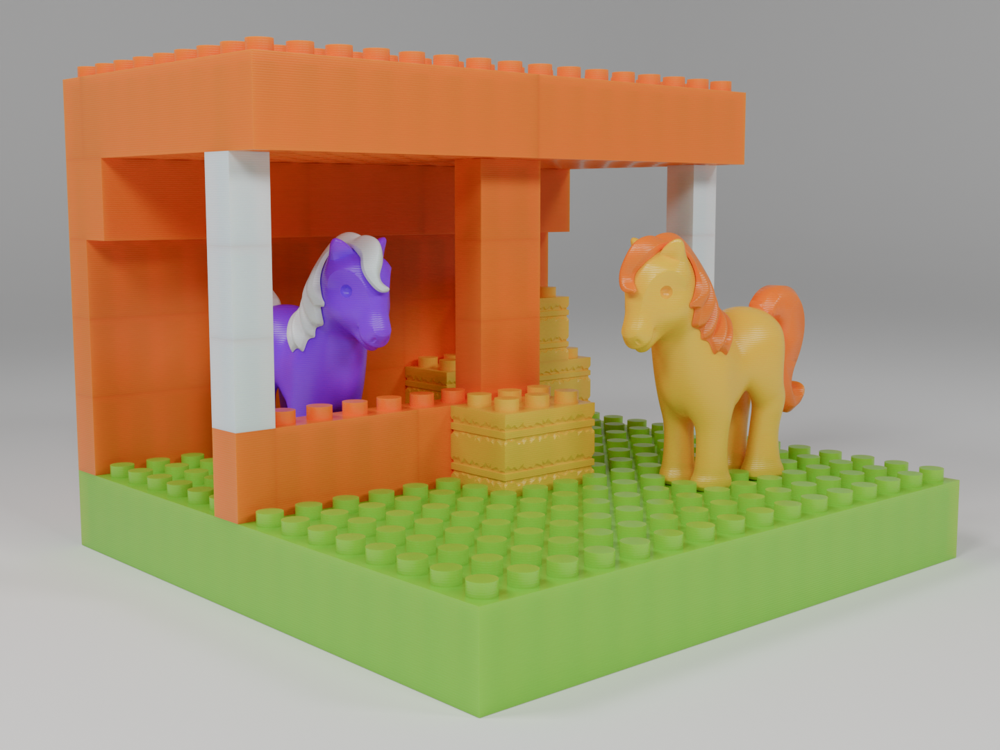

# Oh Funny Horse!
A combination video game and 3D printable construction toy. As you collect items and resources in-game, you'll be able to send them away to be 3D printed physically, though you don't need a printer to play and enjoy the game.

The game is still in early planning stages so nothing is available outside of parts designed for printing. This is available in Models/Parts/, alongside [a page set up on Printables](https://www.printables.com/model/983180-oh-funny-horse-construction-bricks) for download.

(Note: Project folder many need to be set as "F-Deem" to properly compile)
